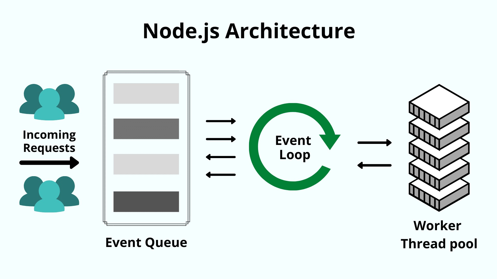
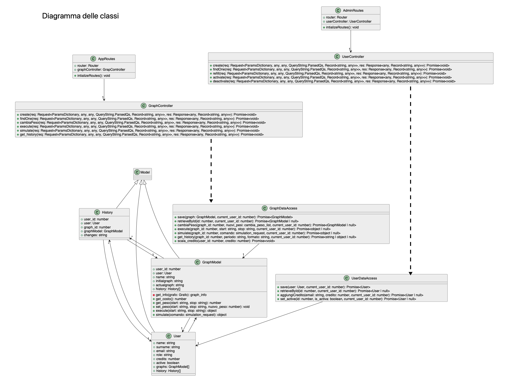
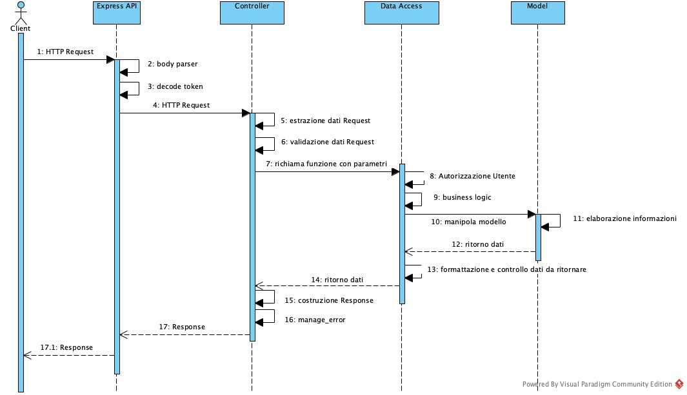

# Progetto MyGraph-Builder

## Descrizione generale

L'applicativo sviluppato è un RESTful Web Service, cioè un sistema software che, comunicando tramite il protocollo HTTP, è in grado di mettersi al servizio di un Client, come ad esempio un'applicazione, un sito web o Postman, e consentire agli utenti che vi si collegano di usufruire delle funzioni che mette a disposizione.

Il modello di business che sottende all'intero progetto è quello del crowd-sourcing, ovvero un sistema che permette agli utenti registrati di creare, modificare e valutare modelli di ottimizzazione su grafo utilizzando il credito a loro disposizione.

Il progetto implementa un servizio di gestione di grafi che, a seconda dell’API scelta e del ruolo dell'utente, permette di:

- inserire un nuovo modello specificando i pesi di ciascun arco, addebitando all'utente il suo costo in termini di credito;
- cercare un modello specificando il suo ID;
- eseguire il modello ottenendo il cammino minimo dal punto di partenza a quello di arrivo specificati (l'operazione addebita all'utente il suo costo in termini di credito);
- gestire le richieste di cambio di peso di uno o più archi del modello specificato secondo la modalità prevista dal sistema;
- fornire l'elenco delle modifiche effettuate ai pesi di un grafo specificato nei formati JSON, csv o PDF;
- simulare il calcolo del cammino ottimo sul grafo scelto, dal punto di partenza a quello di arrivo specificati, al variare del peso di un arco selezionato;
- ricaricare il credito di un utente indicato dell'ammontare specificato;
- creare un nuovo utente
- cercare le informazioni di un utente per ID
- attivare/disattivare un utente

Tutte le rotte richiedono l'autenticazione tramite JSON Web Token (JWT) e il sistema verifica che l'utente sia autorizzato al consumo dell'endpoint richiesto.
Inoltre è stata stata implementata una base di dati per la memorizzazione dei dati relativi agli utenti, ai modelli e alle modifiche apportate ai pesi.

## Ambiente operativo
Lo stack utilizzato dall'applicativo MyGraph-Builder è costituito da Node.js come runtime JavaScript, Express.js come framework HTTP, Sequelize come ORM, Postgres come database.
L'intero codice è scritto utilizzando il linguaggio TypeScript e per il deploy finale si utilizza Docker come runtime per la gestione dei container.
> #### Node.js
Node.js è un runtime system open source multipiattaforma orientato agli eventi che permette l'esecuzione di codice JavaScript, costruito sul motore JavaScript V8 di Google Chrome. Ha permesso l'utilizzo di JavaScript, inizialmente pensato solo per funzionare lato client all'interno dei browser, anche lato server per la realizzazione di Back End o applicazioni desktop. La sua architettura orientata agli eventi rende possibile l'I/O asincrono. Questo design punta ad ottimizzare il throughput e la scalabilità nelle applicazioni web con molte operazioni di I/O. Il modello di networking su cui si basa Node.js non è quello dei processi concorrenti, ma di I/O event driven, infatti Node richede al sistema operativo di ricevere notifiche al verificarsi di determinati eventi, rimanendo in sleep fino all'arrivo della notifica stessa. All'arrivo di una nuova notifica torna attivo per eseguire le istruzioni previste nella funzione di callback, così chiamata perchè deve essere eseguita al ricevimento dell'avviso che il sistema operativo sottostante ha eseguito l'elaborazione richesta e il risultato è disponibile.
Per ulteriori informazioni [Node.js](https://nodejs.org/it).

<h6 align="center">Rappresentazione grafica dell'Event Loop a thread singolo di Node.js </h6>

> #### Express.js
Express.js è un framework open source per Node.js che permette di realizzare sia applicazioni web sia, come nel caso di questo progetto, Back End che espongono endpoint API. Le sue caratteristiche principali sono la flessibilità, la velocità e la scalabilità. Supportato da una nutrita e attiva comunità di sviluppatori, mette a disposizione e si integra con moltissimi moduli in grado di risolvere le problematiche più svariate. Inoltre offre un potente, robusto e personalizzabile sistema di routing. Infine permette di implementare e comporre in maniera semplice una sequenza desiderata di middleware per il trattamento delle rischieste in ingresso.
Per ulteriori informazioni [Express.js](https://expressjs.com).

> #### Sequelize
Sequelize è un ORM per Node.js basato sul concetto di Promise. E' in grado di gestire i più diffusi RDBMS come ad esempio Postgres, Oracle, MySQL, SQLServer, ecc. È dotato di un solido supporto per le relazioni, transazioni, eager e lazy loading e altro ancora.
Realizzato in JavaScript, può essere utilizzato nativamente in TypeScript grazie alla libreria <code>sequelize-typescript</code>.
Per ulteriori informazioni [Sequelize.js](https://sequelize.org).

> #### PostgreSQL
PostgreSQL è un DBMS relazionale e ad oggetti rilasciato con licenza libera (Licenza BSD). Spesso abbreviato come "Postgres", sebbene questo sia un nome vecchio dello stesso progetto, è una reale alternativa sia rispetto ad altri prodotti liberi (come MySQL) che a quelli a codice chiuso (come Oracle) ed offre caratteristiche uniche nel suo genere che lo pongono per alcuni aspetti all'avanguardia nel settore delle basi di dati. È disponibile su tutte le piattaforme ed è scalabile, dall’utilizzo su Personal Computer fino ad applicazioni di livello Enterprise. 
Per ulteriori informazioni [Postgres](https://www.postgresql.org).

> #### Docker
Docker è un software libero progettato per eseguire processi informatici in ambienti isolabili, minimali e facilmente distribuibili chiamati container. Non si basa sui tradizionali metodi di virtualizzazione di un intero sistema operativo, bensì sulla OS-level virtualization fornita dal kernel Linux. È disponibile in ambiente MacOS, Linux e Windows.
Per ulteriori informazioni [Docker](https://www.docker.com).

## Principali Pattern utilizzati nel progetto

> #### Middleware
L'utilizzo del pattern **Middleware** è stato facilitato dell'adozione di Express.js.
Anche la sua struttura è organizzata a middleware, ovvero il processo di listen che viene collegato in ascolto sulla porta specificata passa la richiesta HTTP ricevuta ad una catena di 'funzioni' che, dipendentemente dal verbo HTTP utilizzato e dall'URL dell'endpoint attiva gli oggetti e i relativi metodi appositamente progettati per servire tale richiesta.
Nello specifico i principali middleware utilizzati sono:

- <code>bodyParser.json</code> libreria che parsifica il body delle richieste in ingresso e le restituisce come oggetti json più facilmente manipolabili resi disponibili tramite la proprietà <code>req.body</code>
- <code>decode\_token</code> funzione custom che controlla la presenza del del bearer token nel campo Authorization dell'header della richesta, lo decodifica, estrae il codice utente e lo inserisce nel campo personalizzato <code>current\_user\_id</code> dell'header stesso per averlo disponibile in qualsiasi punto della catena di gestione delle rotte. In caso di fallimento solleva l'opportuna eccezione
- <code>Router</code> libreria di express che permette di accorpare rotte logicamente correlate, associandole ad uno stesso 'prefisso' nella path dell'endpoint

> #### Chain of Responsibility
La funzione <code>decode\_token</code> implementa il concetto classico del pattern CoR, ovvero quello di passare una richiesta attraverso una catena di gestori. Infatti, come precedentemente detto, se la decodifica del token va a buon fine la richesta processata viene passata al gestore successivo. Da notare che l'ordine con cui viene costruita la catena dei gestori è importante, infatti la rotta di utility <code>/api-docs</code> che permette di accedere alla documentazione interattiva Swagger è stata inserita prima della <code>decode\_token</code> ed è dunque accessibile da tutti senza necessità di autorizzazione.

> #### Data Access Object
Come da documentazione di Sequelize (l'ORM utilizzato) _'Un model è una classe ES6. Un'istanza della classe rappresenta un oggetto di quel model (che viene mappato a una riga della tabella corrispondente nel database). In questo modo, le istanze del modello sono dei DAO.'_
In MyGraph-Builder il DAO viene implementato dal modulo <code>models</code> che utilizza le funzionalità messe a disposizione da Sequelize.

> #### Model-View-Controller
I sorgenti di MyGraph-Builder sono stati organizzati in moduli, seguendo la filosofia tipica del pattern MVC. 
- **MODEL:** è implementato dal modulo <code>data_access</code> in collaborazione con il modulo <code>models</code>. Il **MODEL** riceve le richieste dal **CONTROLLER** e le soddisfa interagendo con la base di dati sottostante tramite metodi appositamente realizzati, sia per le funzionalità CRUD che di business logic;
- **VIEW:** in questo caso, essendo un'applicazione Back End, la 'view' è rappresentata dal modulo <code>routes</code>, che serve gli endpoint consumati dalle applicazioni client;
- **CONTROLLER:** è implementato dal modulo <code>controllers</code>, che estrae i dati dalla Request, ne controlla la consistenza, invoca i metodi opportuni del <code>data_access</code> e riporta alla **VIEW** i risultati dell'elaborazione o gli eventuali codici di errore.

> #### Decorator
L'utilizzo di Sequelize, libreria nativa JavaScript, in ambiente TypeScript viene facilitato dall'impiego di opprtuni decoratori messi a disposizione dalla libreria <code>sequelize-typescript</code> che permette di descrivere la struttura dei modelli in maniera più semplice e dichiarativa (come visibile nei file presenti nel modulo <code>./src/models</code>).

> #### Promise
Questo pattern non è annoverato tra i design pattern classici, ma ha acquisito un ruolo molto importante nella programmazione *JavaScript/TypeScript*, in particolare nel supporto alla programmazione asincrona, cioè alla possibilità di eseguire attività in background che non interferiscono con il flusso di elaborazione principale, come nel caso di richieste dirette al server o ad altri componenti dell'ambiente di esecuzione dell'applicazione.
Per gestire il risultato di un'elaborazione asincrona viene normalmente sfruttato il meccanismo delle callback.
Se si ha la necessità di richiamare funzioni asincrone in cascata ci si accorge subito di come risulti indaginoso gestire la stratificazione delle callback che, proprio per questo, ha preso il nome familiare di 'callback hell' (il codice assume un aspetto difficilmente leggibile).

Per mantenere il codice compatto e facilmente manutenibile è possibile adottare il Promise Pattern, secondo il quale la Promise è un oggetto che rappresenta il risultato pendente di un'operazione asincrona. Questo oggetto può essere usato per definire le attività da eseguire dopo che l'esecuzione asincrona è terminata.
Un oggetto di tipo Promise può essere:
- Pending
- Fulfilled
- Rejected

Inoltre l'oggetto Promise supporta due proprietà: *state* e *result*.
- Mentre un oggetto Promise è "Pending" (in esecuzione), il risultato è <code>undefined</code>.
- Quando un oggetto Promise è "Fulfilled", il risultato è un <code>valore</code>.
- Quando un oggetto Promise è "Rejected", il risultato è un <code>error object</code>.

Nel progetto le Promise sono utilizzate, tra l'altro, nel modulo <code>data_access</code> per rendere asincrone le interazioni col modello.

## Diagrammi UML

<h6 align="center">Diagramma delle classi</h6>

<h6 align="center">Diagramma delle sequenze </h6>

## Application Programming Interface: cosa fanno e come si usano
Le API implementate, la loro descrizione funzionale, le relative rotte, i payload, i risultati ed i possibili codici di errore sono consultabili accedendo alla [documentazione interattiva Swagger](https://petstore.swagger.io/?url=https://raw.githubusercontent.com/Matteo-Lorenzo/mygraph-builder/main/swagger.yml).
Utilizzando questa intuitiva interfaccia grafica è anche possibile interagire con gli endpoint in locale per eseguire gli opportuni test.

## Peculiarità

